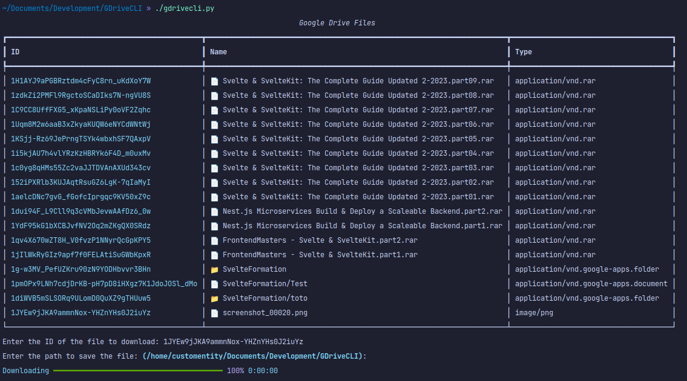

# How to Use the GDriveCLI Script

This script uses the Google Drive API to download a file from your Google Drive account. It will prompt you to enter the ID of the file you want to download and the path where you want to save it.

## Setup

Before running the script, you need to set up the Google Drive API and obtain the `credentials.json` file. Follow these steps to set up the API:

1. Go to the [Google API Console](https://console.developers.google.com/).
2. Click "Create Project" and give your project a name.
3. Click "Create" to create the project.
4. Click on the "Enable APIs and Services" button.
5. Search for "Google Drive API" and click on it.
6. Click the "Enable" button.
7. Click on "Create credentials".
8. Select "Desktop app" as the type of application and "User data" as the data to access.
9. Give your client ID a name and click "Create".
10. Click "Download" to download your credentials as a JSON file.

Once you have downloaded the `credentials.json` file, save it in the same directory as the script.

You also need to install the necessary Python modules. Run the following command to install them:

```bash
pip install -r requirements.txt
```

## Usage

To run the script, use the following command:

```bash
python gdrivecli.py
```

The script will prompt you to enter the ID of the file you want to download and the path where you want to save it. The file will be saved in the current directory if you don't specify a path.

## Troubleshooting

If you encounter any issues while running the script, try the following:

- Make sure you have entered the correct file ID and save path.
- Make sure you have the necessary permissions to access the file.
- Make sure you have set up the Google Drive API correctly and have the credentials.json file in the same directory as the script.
- Make sure you have installed the necessary Python modules.

If you are still having issues, please open an issue on GitHub and refer to the [Google Drive API documentation](https://developers.google.com/drive) for more information or post your issue in a relevant forum.

## How It Looks

